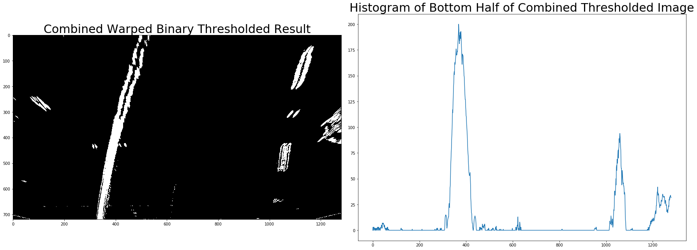
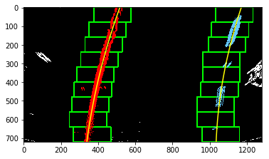
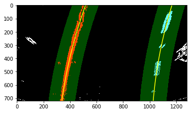
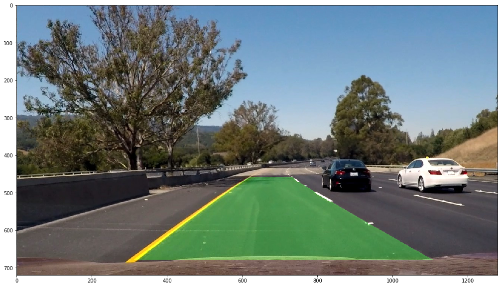

# Project 2: Advanced Lane Finding

---

### **Advanced Lane Finding**

The goals / steps of this project are the following:

* Compute the camera calibration matrix and distortion coefficients given a set of chessboard images.
* Apply a distortion correction to raw images.
* Use color transforms, gradients, etc., to create a thresholded binary image.
* Apply a perspective transform to rectify binary image ("birds-eye view").
* Detect lane pixels and fit to find the lane boundary.
* Determine the curvature of the lane and vehicle position with respect to center.
* Warp the detected lane boundaries back onto the original image.
* Output visual display of the lane boundaries and numerical estimation of lane curvature and vehicle position.

[//]: # (Image References)
---  
The project consists of first developing a pipeline

### 1.0 Camera Calibration

Camera parameters include intrinsics, extrinsics (camera matrix 'mtx'), and distortion coefficients ('dist'). To estimate the camera parameters, you need to have 3-D world points and their corresponding 2-D image points. You can get these correspondences using multiple images of a calibration pattern, such as a chessboard. Using the correspondences, you can solve for the camera parameters.

Camera parameters include intrinsics, extrinsics, and distortion coefficients. To estimate the camera parameters, you need to have 3-D world points and their corresponding 2-D image points. You can get these correspondences using multiple images of a calibration pattern, such as a checkerboard. Using the correspondences, you can solve for the camera parameters. 

I developed a camera calibration function when Camera calibration, given object points, image points, and the shape of the grayscale image, returns distortion coefficients (dist) camera matrix (mtx), camera position in the world, rotation (rvecs), translation (tvecs).

I start by preparing "object points", which will be the (x, y, z) coordinates of the chessboard corners in the world. Here I am assuming the chessboard is fixed on the (x, y) plane at z=0, such that the object points are the same for each calibration image.  Thus, `objp` is just a replicated array of coordinates, and `objpoints` will be appended with a copy of it every time I successfully detect all chessboard corners in a test image.  `imgpoints` will be appended with the (x, y) pixel position of each of the corners in the image plane with each successful chessboard detection.  

I then used the output `objpoints` and `imgpoints` to compute the camera calibration and distortion coefficients using the `cv2.calibrateCamera()` function.  I applied this distortion correction to the test image using the `cv2.undistort()` function and obtained this result:

### 2.0 Image Distortion Correction

The lens used in a camera is not a perfect piece of glass, so some form of distortion might be present in the image it captures. There is what we call radial distortion in which the light bends at a certain angle that deviates from a rectilinear plane.  Therefore, we need to correct for image distortion utilizing our camera matrix and distortion coefficients.  Distortion can - 

* change the apparent size of an object in an image.  
* change the apparent shape of an object in an image.  
* cause an objects appearance to change depending on where it is in the field of view.  
* and make objects appear closer or father away than they actually are.

I utilized `cv2.undistort(img, mtx, dist, None, mtx)` to perform an image distortion correction.

### 3.0 Apply a Perspective Transform

Transforming an image such that we are effectively viewing objects from a different angle or direction.  Objects appear smaller the farther away they are from a viewpoint, like a camera, parallel lanes appear to converge to a point.  We are interested in a perspective transform as we want to ultimately measure the curvature of a lane line.
To accomplish this I needed to transform a top-down view using `cv2.getPerspectiveTransform()` to obtain the to get `M`, the transform matrix and `Minv` the inverse transform matrix, to be utilized later to transform our image back.  Prior to transforming my image I had to select source points `src` and destination points `dst`.   In Perspective Transform, we need provide the points `src` on the image from which want to gather information by changing the perspective. We also need to provide the points inside which we want to display our image `dst`. Then, we get the perspective transform from the two given set of points and wrap it with the original image using ` cv2.warpPerspective()`  to warp your image to a top-down view.

### 4.0 Thresholding

In digital image processing, thresholding is the simplest method of segmenting images. From a grayscale image, thresholding can be used to create binary images. 

### 4.a Sobel Operator Threshold

Sobel operators is a joint Gausssian smoothing plus differentiation operation, so it is more resistant to noise. You can specify the direction of derivatives to be taken, vertical y or horizontal x.  The Sobel operator is at the heart of the Canny edge detection algorithim.  Applying the Sobel operator to an image is
a way of taking the derivative of the image in the x or y direction.  As lane lines are mostly vertical, I choose to use a Sobelx, denoted by 1,0, `cv2.Sobel(gray, cv2.CV_64F, 1, 0)` whereas Sobely would be 0,1.  I converted the image to 8-bit and a binary threshold to select pixels based on gradient strength from 20 to 100.  The result was lane lines identified as follows:

### 4.b Magnitude of the Gradient

Apply a threshold to the overall magnitude of the gradient, in both x and y direction by taking the square root of Sobelx^2 and Sobely^2 `np.sqrt(sobelx**2 + sobely**2)` converting again to grayscale and 8-bit and a binary threshold to select pixels based on gradient strength from 20 to 100.  The result was lane lines identified as follows:

### 4.c Direction of the Gradient

When looking at lane lines, knowing the direction of the gradient can be useful, as we know lane lines we are interested are of a particular orientation.  We can determine the direction, or orientation, of the gradient. Each pixel of the resulting image contains a value for the angle of the gradient away from horizontal in units of radians, covering a range of −π/2 to π/2. An orientation of 0 implies a vertical line and orientations of +/− π/2 imply horizontal lines.

The direction of the gradient is simply the inverse tangent (arctan) of the y gradient divided by the x gradient, arctan(sobely/sobelx) `np.arctan2(np.absolute(sobely), np.absolute(sobelx))`  It can be seen for the yellow line, the direction of the gradient determined this well.

### 4.d Colour Thresholding 

RGB is red-green-blue color space, where any color can be represented by a 3D coordinate of R, G and B values. For example, white has the coordinate (255,255,255), which has the maximum value for red, green, and blue.  HSV is hue-saturation-value colorspace and HLS is hue, lightness and saturation.  Which we will utilize in our function.

* Hue is a value that represents color independent of any change in brightness.  
* Lightness and Value represent different ways to measure the relative lightness or darkness of a color.  
* Saturation is a measurement of colorfulness, i.e. as a colors get lighter and closer to white, they have a lower saturation value.  

 `hls = cv2.cvtColor(img, cv2.COLOR_RGB2HLS)` was the function used and I isolated for saturation as it was best at identifying lane lines in most scenarios including (shadows).  However, in periods of approached the cement bridge, change in pavement the path drifted, therefore I found that combining with lightness also aided in detecting the white dashed lines.   A binary threshold to select pixels based from 120 to 255 was applied for saturation and 200 to 255 for lightness.  The result was lane lines identified as follows:
    

### 5.0 Combine Colour and Gradient Thresholding

Each thresholding filter offers advantages and disadvantages, by utilizing four filters as described above, we are able to combine them into a single image filter for futher processing of the lane lines.  The image below is the combined binary output of all thresholding filters, with good results on identifying the lane lines.

### 6.0 Find Lane Lines Using Sliding Windows

To accomplish this we'll use a method called "Peaks in a Histogram" where we analyse the histogram of section of the image, window, and identify the peaks which represent the location of the lane lines.  We then split the image in to two, for the right lane and left lane detection. 

Once you've detected pixels in a sliding window, there is a minimum number of pixels to be detected before a recentre of our windows on the lane line.  Once completed, the function will now find points to be fitted with the second-order polynomial using the sliding window technique. I have shaded the left yellow lane line in red, and you can see the white dotted line for passing is in blue.

### 7.0 Search Around For Lane Lines

Once we have used the sliding windows function and detected lane lines and right and left lane indicies, we can return these values for the next frame in the video to search around for lane lines based on activated x-values within the +/- margin of our polynomial function.  This should speed up processing time as our search area has been greatly narrowed.

### 8.0 Determine the curvature of the lane and vehicle position with respect to center.

Utilizing output values in pixel space based on the polynomials calculated, we can utilize a few mathematical operators to determine the left and right lane curvature and average curvature based on those two values.  Secondly, if we assume the camera is mounted directly in the centre of the vehicle, determining the centre of the lane we can calculate a vehicle offset from the centreline of the calculated lane. `measure_curvature_real()` is the function I wrote to calculate these values.

### 9.0 Warp the detected lane boundaries back onto the original image.

Once we have thresholded and determined our lane line locations, curvatures and position of vehicle, we can transpose these values on the image, however, we must consider that the image is still warped and using the `Minv` the inverse transform matrix we can utilze the warp perspective and place our lane boundaries back onto the original image.
`cv2.warpPerspective(color_warp, Minv, (image.shape[1], image.shape[0]))`

### 10.0 Run Pipeline

Once the pipeline can correctly identify each of the test images we can utilize a function `findlane(img)` to call each of the methods described above to process each frame of the video.  The result output of the video can be seen in Figure 1 above.

### 11.0 Possible Improvements for Pipeline

I feel my pipeline does a good job of identifying the lane lines.  What I have noticed is that in rapid changes of high contrast, brightness or dark shawdows the lane detection failed momentarily.  I went back and looked at the frames at 21 seconds and 41 seconds and added and corrected thresholds.  Secondly, I feel I should also average the lane lines before committing to a fitted polynomial.  Lastly, for colour changes, I feel that certain thresholds can be activated in a lane line is not detected, i.e. higher areas of lightness, etc.  I plan to return to this pipeline to improve it for different driving conditions and to add a class to store the variables of the previous frame results where a lane was detected for improved path detection.

Overall, this was a wonderful project.  I always saw images of lane detection animations on televison or in SAE articles and wanted to learn more how to develop these.  Now I have developed my own and this is really exciting.  I plan to calibrate my own camera and test my pipeline out on my own highway.
